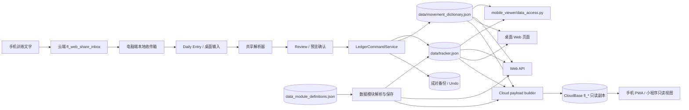
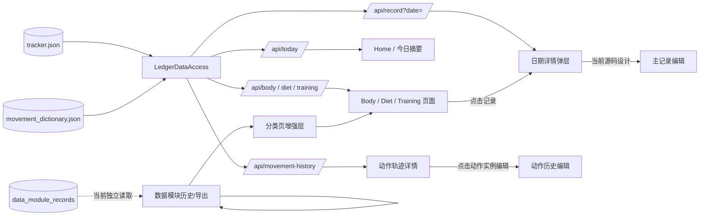
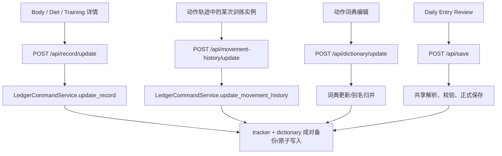
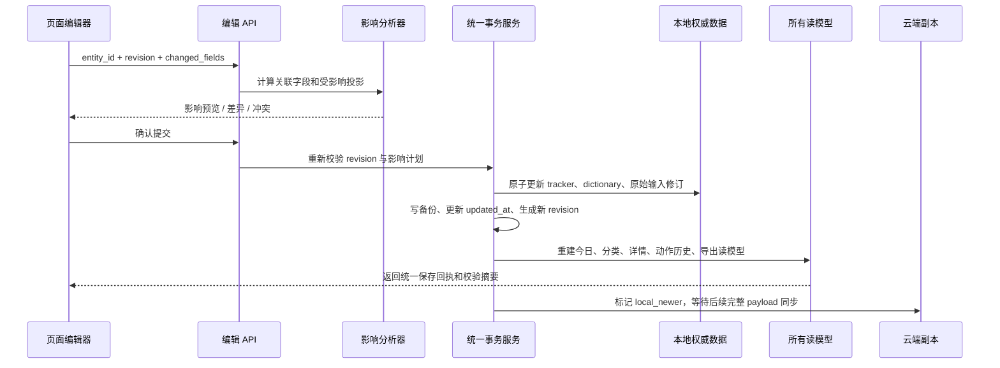

# Fitness Ledger 记录字段关系谱系与编辑流

更新时间：2026-09-03

用途：在修改编辑、数据模块、手机同步和动作备注之前，明确每个字段的权威来源、读取投影、编辑入口和应更新的关联范围。

## 1. 当前总体信息流



说明：当前正式数据的主存储仍然是 `tracker.json` 和 `movement_dictionary.json`。页面、导出和云端是投影，不应各自保存另一套业务事实。

## 2. 当前字段关系谱系

```mermaid
flowchart TB
    RAW[raw_entries<br/>id / date / raw text / source]
    DAY[日期<br/>Date / date]
    BODY[daily_records<br/>id<br/>Date / Weight / Bowel Movement<br/>Training / Cardio / Notes]
    DIET[diet_records<br/>id<br/>Date / Calories / Protein / Carbs / Fat<br/>Food Summary / Notes]
    SESSION[training_sessions<br/>id / No. / Date<br/>Split / Raw Record<br/>Standardized Summary / Notes]
    DEF[movement dictionary<br/>movement_id<br/>display_name / english_name / aliases<br/>muscle_group / category / equipment<br/>active / notes]
    HIST[tracker.movements[*].history[*]<br/>id / movement_id / date / training_day<br/>order / sets / cardio / raw / notes]
    MODDEF[data module definition<br/>module_id / aliases / category_id<br/>unit / presentation / version]
    MODREC[data_module_records<br/>record_id / module_id / category_id<br/>date / value / actual_unit / definition_version]

    RAW -->|解析产生| DAY
    DAY --> BODY
    DAY --> DIET
    DAY --> SESSION
    SESSION -->|当前主要靠 No. = training_day| HIST
    DEF -->|display name / alias 解析| SESSION
    DEF -->|movement_id 解析与展示| HIST
    MODDEF -->|alias 匹配| MODREC
    DAY --> MODREC
    RAW -->|保存原文/来源哈希| MODREC
```

### 字段的业务权威性

| 字段/概念 | 当前权威来源 | 当前主要消费者 | 编辑位置 | 现存风险 |
|---|---|---|---|---|
| 日期 | 各主记录的 `Date`；数据模块为记录自身 `date` | 今日、分类页、详情、导出、云端 | 主记录编辑器；数据模块保存 | 没有统一的日期聚合实体；模块日期可能不进入普通详情 |
| Body 数值 | `daily_records` | Body 页、今日摘要、详情、云端 `fl_daily_records` | `/api/record/update` | 修改日期不会迁移所有关联来源 |
| Diet 营养 | `diet_records` | Diet 页、今日摘要、详情、云端 `fl_diet_records` | `/api/record/update` | 与同日 Body/Training 只是按日期拼接 |
| Training 主记录 | `training_sessions` | Training 页、详情、云端 `fl_training_sessions` | `/api/record/update` 或 Daily Entry 保存 | `Raw Record`、结构化摘要和动作历史可能分离 |
| 动作身份 | `movement_dictionary` 的 `movement_id` | 解析、动作索引、历史、云端 `fl_movements` | 词典编辑、归并流程 | 展示名称依赖当前字典；原始名称保留在原文 |
| 动作训练实例 | `tracker.movements[*].history[*]` 的 `id` | 动作轨迹、训练详情、成长统计 | `/api/movement-history/update` | 当前主要用 `training_day` 关联会话，缺少显式会话外键 |
| 原始输入 | `raw_entries` | 详情原始输入、审计 | 当前保存；普通 Web 编辑未开放 | 主记录与原始输入缺少统一可追溯编辑事务 |
| 动作长期备注 | 字典项 `notes`（已有字段） | 当前词典编辑可写 | 词典编辑器 | 未在动作详情和云端投影中稳定展示 |
| 单次训练备注 | `movement_history.notes` | 某次动作历史、训练详情 | 动作历史编辑器 | 不能替代动作长期备注 |
| 数据模块记录 | `data_module_records` | 模块历史、导出、部分分类页增强层 | 数据模块确认保存 | 不属于普通 Body/Diet/Training 日期记录 |
| 云端副本 | `cloud_payload` 生成结果 | PWA/小程序只读展示 | 本地构建后同步 | 是只读副本，不应作为编辑主库 |

## 3. 当前页面信息如何流动



当前最重要的断点是：`/api/record` 的普通日期详情读取 Body、Diet、Training 和 raw entries，但没有把 `data_module_records` 作为同一日期详情的一部分；因此“分类页能看到”不等于“详细数据能看到”。

## 4. 当前编辑行为的位置



当前源码中已经有若干编辑命令，但正式服务实际打开记录时仍是只读详情，说明发布版本和工作区代码存在不一致。并且现有 `update_record` 只更新选定主记录；它还没有承担“修改日期后迁移所有关系”或“修改训练原文后重建动作历史”的职责。

## 5. 编辑时必须维护的关系

### 5.1 Body / Diet

```text
record_id
  ├─ Date
  ├─ 该日期下的 Body 或 Diet 字段
  ├─ raw_entry_id（当前缺少明确统一外键）
  └─ record_day_id（建议新增的日期聚合键）
```

修改数值或备注时，必须更新：今日摘要、分类页、日期详情、搜索索引、导出和下一次云端 payload。

修改日期时，必须先给出影响计划，确认后整体迁移，而不是只修改单个 `Date` 字段。

### 5.2 Training / Movement History

```text
training_session_id
  ├─ Date
  ├─ No.
  ├─ Split
  ├─ Raw Record
  ├─ Standardized Summary
  ├─ Notes
  └─ movements[*]
       └─ movement_history_id
          ├─ movement_id
          ├─ order
          ├─ sets
          ├─ cardio
          ├─ raw
          └─ notes
```

建议补充显式 `training_session_id` 到动作历史。`No.` 可以继续作为展示顺序，但不应继续承担主关联键。

训练主记录编辑和动作实例编辑必须形成双向一致策略：

- 修改动作组数、重量、动作实例备注：更新动作历史，并重新生成训练结构化摘要；
- 修改训练原文：重新解析，给出动作增删、映射变化和备注变化，再确认写入；
- 修改日期或训练会话：同步迁移所有动作历史；
- 原始文本保留修订版本，避免编辑后失去审计依据。

### 5.3 Movement Definition

```text
movement_id
  ├─ display_name
  ├─ english_name
  ├─ aliases
  ├─ muscle_group / category / equipment
  ├─ notes_long_term
  └─ history[*].movement_id
```

修改名称或别名时，动作历史仍通过 `movement_id` 关联；页面显示名称随字典投影更新，原始输入和历史原始动作写法保留。

### 5.4 Data Module

```text
module_id
  ├─ label / aliases / unit / presentation / definition_version
  └─ module_record_id
       ├─ record_day_id
       ├─ date
       ├─ value
       └─ definition_snapshot
```

数据模块应加入统一的 `record_day_id` 或日期聚合读模型，让分类页和日期详情使用同一个日期骨架；没有值时显示“空模块位置”，但不伪造一条实际数据记录。

## 6. 建议的统一编辑事务



### 事务不变量

1. 每条实体都有稳定且不可变的 ID；展示名称、别名不能作为外键。
2. 每个业务字段只有一个权威写入位置；页面和云端只保存投影。
3. 修改日期、动作身份、训练原文等高影响字段必须先展示影响范围。
4. 本地权威数据、备份和索引更新必须在同一事务边界内完成；失败则整体回滚。
5. 返回保存回执后，页面必须从读模型重新读取，而不是只修改浏览器内存。
6. 云端保持只读副本语义；本地修改先标记 `LOCAL_NEWER`，同步成功后再变为 `SYNCED`。

## 7. 后续实现验收矩阵

| 操作 | 必须验证的结果 |
|---|---|
| 修改 Body 体重 | 今日、Body 页、日期详情、导出、云端 payload 一致 |
| 修改 Diet 宏量 | Diet 页、今日摘要、详情、导出一致 |
| 修改训练 Split/备注 | Training 页、详情、搜索、导出一致 |
| 修改训练原文 | 动作识别、动作历史、结构化摘要、原始修订记录一致 |
| 修改动作组数 | 该动作历史、训练详情、成长统计一致 |
| 修改动作长期备注 | 动作索引、动作详情、词典、云端动作投影一致；历史实例备注不变 |
| 修改单次动作备注 | 只改变指定日期的动作历史，不改变动作长期备注 |
| 修改记录日期 | Body/Diet/Training、raw、动作历史、数据模块和云端投影整体迁移 |
| 新增数据模块无值 | 分类页显示明确空模块位置；详情页显示暂无数据；不生成假数值记录 |
| 手机发送第 8 条 | 云端仍保留接收内容；电脑本地仅淘汰最旧一条，保留最新 7 条完整记录 |

## 8. 候选实现落点（2026-09-03）

本候选分支已把谱系落到现有 JSON 和命令服务，不另建第二套业务数据库：

- `fitness_ledger_core/record_relations.py` 提供幂等兼容迁移、`record_day_id`、`raw_revision_id` 和关系完整性校验；旧数据先在内存兼容，明确迁移写入时才通过成对备份持久化。
- `ledger_commands.py` 的 Body/Diet/Training、动作实例、动作词典、数据模块值和训练原文入口统一经过 revision 校验、成对 checkpoint、原子写入和重新读取；训练原文保存前必须先生成差异并确认。
- `mobile_viewer/data_access.py` 和 `fitness_ledger_core/shared_view_models.py` 都从同一 tracker/dictionary 快照读取，日期详情补齐数据模块和原始修订；训练动作优先使用 `training_session_id`，旧数据保留日期/No. 兼容回退。
- 云端 payload 增加动作定义长期备注与关系/版本字段；云端仍是只读投影，本地成功写入回执为 `LOCAL_NEWER`。
- Web 候选增加日期详情的 Body/Diet/Training 编辑、数据模块值编辑、动作实例 revision 编辑和训练原文差异确认入口。

候选专用自动证据为 `tools/unified_edit_chain_test.py`，覆盖迁移、跨模型读取、revision 冲突、备注分离、原文确认、模块编辑和中途写入失败回滚。
