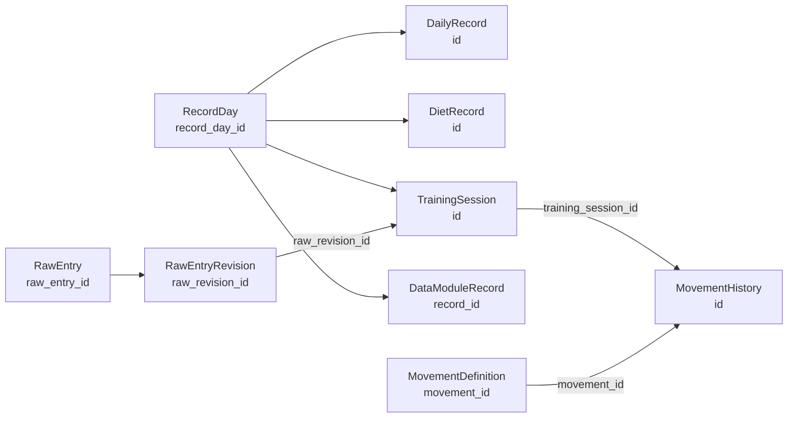

# Fitness Ledger：底层数据关系与统一编辑链路报告

日期：2026-09-03
状态：候选分支完成，等待人工 Review；未写回正式业务目录。

## 1. 保留的开始节点

| 项目 | 结果 |
|---|---|
| 项目目录 | `D:\FitnessLedger\source\projects\fitness-ledger` |
| 正式运行目录 | `D:\FitnessLedger\app` |
| 正式数据目录 | `D:\FitnessLedger\app\data` |
| 候选分支 | `codex/fitness-ledger-unified-edit-20260903` |
| 开始保护节点 | `569238ed5b7697e2d7f12988fcd179254baaca87` |
| 核心实现 HEAD | `7ec84b5df7c1a441508de98371b4c3335b6ffb5d` |
| 工作区 | 干净 |
| 正式 tracker SHA256 | `969deffff0d6806fc669fdb03e5ef1224472785625370113730280d593434040` |
| 正式 dictionary SHA256 | `2417e1871c8398f22d9f707050b89a054f2e70af4b583f0d34e9ab72c90a749c` |
| 正式云端状态 | `SYNCED`，最新日期 `2026-09-02` |

开始前已有未提交修改已先保存在保护提交中，没有覆盖或丢弃。

## 2. 正式实体与字段归属

| 实体 | 正式保存内容 | 稳定 ID | 编辑位置 |
|---|---|---|---|
| `RecordDay` | 一天的聚合边界 | `record_day_id` | 日期详情、日期移动 |
| `DailyRecord` | 体重、身体指标、排便、训练概述 | `id` | Body、日期详情 |
| `DietRecord` | 热量、蛋白质、碳水、脂肪、饮食摘要 | `id` | Diet、日期详情 |
| `TrainingSession` | Split、训练备注、训练原文、结构摘要 | `id` / `training_session_id` | Training、日期详情 |
| `MovementHistory` | 某次训练的重量、组数、顺序、单次备注 | `id` | 动作详情 |
| `MovementDefinition` | 动作名称、别名、分类、器械、长期备注 | `movement_id` | 动作词典、动作详情 |
| `DataModuleRecord` | 某天某个数据模块的正式数值 | `record_id` | 数据模块、日期详情 |
| `RawEntryRevision` | 原始输入和每次修订 | `raw_revision_id` / `raw_entry_id` | 原始记录差异确认 |

`No.`、展示名称和别名只用于展示或匹配，不作为正式外键。

## 3. 字段关系图



## 4. 统一编辑链路

```text
业务编辑命令
→ ID 与 revision 校验
→ 影响分析
→ 修改正式 tracker/dictionary
→ 重建训练摘要或失效派生读取
→ 成对备份与原子写入
→ 关系完整性校验
→ 页面重新请求后端
→ LOCAL_NEWER
→ 完整云端同步后变为 SYNCED
```

云端继续作为本地正式数据的只读投影。手机收件箱继续采用：云端成功接收，电脑读取后本地只保留最新七条；本地淘汰不删除云端记录。

## 5. 实际代码改动

### 数据关系与迁移

- 新增 `fitness_ledger_core/record_relations.py`。
- 为旧数据补齐 `record_day_id`、`training_session_id`、`raw_entry_id`、`raw_revision_id`、`revision`、`updated_at`。
- 迁移在内存中幂等执行；明确迁移或下一次业务写入时才通过成对备份持久化。
- 新增关系完整性校验，阻止关系化数据产生孤立动作历史、错误日期聚合或缺失日期实体。

### 统一编辑命令

- `LedgerCommandService` 统一处理 Body、Diet、Training、动作定义、动作实例、数据模块和训练原文。
- 编辑命令支持 revision 乐观锁，旧页面提交返回 `REVISION_CONFLICT`。
- 训练原文直接编辑被禁止，必须先执行差异预览，再确认更新训练会话、动作历史、原始修订和摘要。
- 动作重量、组数、顺序或单次备注变化后，自动重新生成训练摘要。
- 支持“仅移动当前记录”和“移动整日关联记录”。
- 原子写入增加 flush/fsync，并保留原有 Undo 与成对备份。

### 统一读取与云端投影

- `LedgerDataAccess` 与 `LedgerViewModels` 从同一正式快照读取。
- 日期详情同时返回 Body、Diet、Training、数据模块、原始输入和原始修订。
- 训练动作优先通过 `training_session_id` 读取，不再仅依赖日期和 `No.` 临时拼接。
- 云端 payload 增加动作长期备注、关系字段和版本字段。

### 页面与 API

新增或接通：

```text
GET  /api/schema/status
POST /api/schema/migrate
POST /api/record/update
POST /api/movement-history/update
POST /api/data-module-record/update
POST /api/training/raw-preview
POST /api/training/raw-apply
```

候选页面包含日期详情编辑、数据模块值编辑、动作实例编辑、动作长期备注编辑，以及训练原文差异确认入口。

## 6. 测试执行结果

### 自动化测试

以下命令均通过：

```text
python tools/unified_edit_chain_test.py
python tools/data_module_engine_test.py
python tools/movement_lifecycle_core_test.py
python tools/movement_instance_progress_core_test.py
python tools/mobile_desktop_sync_contract_test.py
python -m py_compile fitness_ledger_core/record_relations.py ledger_commands.py mobile_viewer/data_access.py fitness_ledger_core/data_module_engine.py fitness_ledger_core/shared_view_models.py fitness_ledger_core/cloud_payload.py web_desktop/backend/server.py tools/unified_edit_chain_test.py
node --check web_desktop/frontend/app.js
git diff --check
```

测试结果：

| 测试 | 结果 |
|---|---|
| 统一编辑链路专用测试 | 通过，6 项 |
| 数据模块既有测试 | 通过，10 项 |
| 动作生命周期测试 | 通过 |
| 动作进步测试 | 通过 |
| 手机/桌面同步契约测试 | 通过 |
| Python 语法检查 | 通过 |
| JavaScript 语法检查 | 通过 |
| `git diff --check` | 通过 |

专用测试覆盖：迁移备份、Body/Diet/Training 统一读取、revision 冲突、动作长期/单次备注分离、原文差异确认、数据模块编辑、整日移动和中途写入失败整体回滚。

### 候选 API 验证

候选服务使用正式数据副本，不使用正式数据文件：

- 候选地址：`http://127.0.0.1:8770`
- 候选 build：`candidate-unified-edit-20260903`
- `/api/health`：通过
- `/api/schema/status`：通过
- `/api/schema/migrate`：通过，副本迁移完成
- `/api/record?date=2026-09-02`：同时返回 Body、Diet、Training、数据模块、原始输入和原始修订

证据文件：`D:\FitnessLedger\scratch\fitness-ledger-unified-edit-20260903\candidate_evidence.json`

## 7. 正式环境边界

本次没有：

- 修改 `D:\FitnessLedger\app` 正式源码或正式数据；
- 重启正式服务 `http://127.0.0.1:8766`；
- 执行正式数据迁移；
- 合并 main、推送或发布。

当前正式服务仍报告旧构建：

```text
87b314a071b18884d55a958014b54243a7b69143
branch: codex/fitness-ledger-modal-sync-feedback-20260826
```

因此正式页面尚不能视为已经使用本次候选代码。

## 8. 人工 Review 操作

1. 打开 `http://127.0.0.1:8770`。
2. 进入日期详情，确认 Body、Diet、Training、数据模块和原始修订都可见。
3. 修改体重，检查首页、Body、日期详情和导出结果。
4. 修改 Diet 宏量、Training Split 和训练备注，检查相关页面和详情。
5. 在动作详情分别修改动作长期备注和某次训练备注，确认两者互不覆盖。
6. 修改训练原文，确认先显示新增、删除、映射、组数和备注差异。
7. 不确认差异时关闭窗口，确认数据不变；确认后检查训练摘要和动作历史。
8. 修改日期，分别测试“仅移动当前记录”和“移动整日关联记录”。

## 9. 剩余风险

- 正式服务尚未使用候选构建，正式迁移和发布必须在人工 Review 后另行授权。
- 云端同步失败注入尚未执行；本地数据写入与 `LOCAL_NEWER` 逻辑已完成，但仍需真实同步链路验证。
- 正式业务数据尚未迁移，因此正式数据中新增关系字段的最终数量和个别历史边界仍需在备份后执行正式迁移预览确认。
